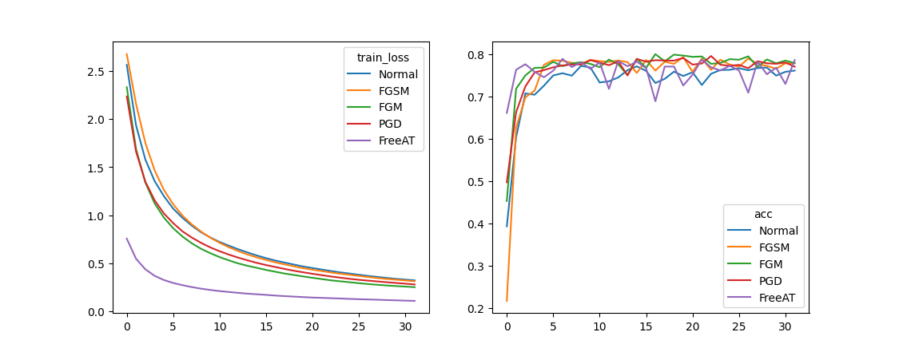

Implementation of some adversarial training function like FGM, FGSM, PGD, FreeAT.

### Quick Start

You can find a simple demo for bert classification in test_bert.py.   
you can run it easily by the script below.
> cd scripts
> sh run_at.sh


Here is a simple demo of usage:  
You just need to rewrite train function according to input for your model in file PGD.py, then you can use adversarial
training like below.

```python
import transformers
from model import bert_classification
from adversarial_training.PGD import PGD

batch_size, num_class = 64, 10
# model = your_model()
model = bert_classification()
AT_Model = PGD(model)
optimizer = transformers.AdamW(model.parameters(), lr=0.001)

# rewrite your train function in pgd.py
outputs, loss = AT_Model.train_bert(token, segment, mask, label, optimizer)
```

### Adversarial Training Results Compare
  

|  Adversarial Training  | Time Cost(s/epoch ) | best_acc |
|:----------------------:|:-------------------:|:--------:|
| Normal(not add attack) |        23.77        |  0.773   |
|          FGSM          |        45.95        |  0.7936  |
|          FGM           |        47.28        |  0.8008  |
|        PGD(k=3)        |        87.50        |  0.7963  |
|      FreeAT(k=3)       |        93.26        |  0.7896  |  


### Reference
- https://github.com/locuslab/fast_adversarial
- https://github.com/ashafahi/free_adv_train